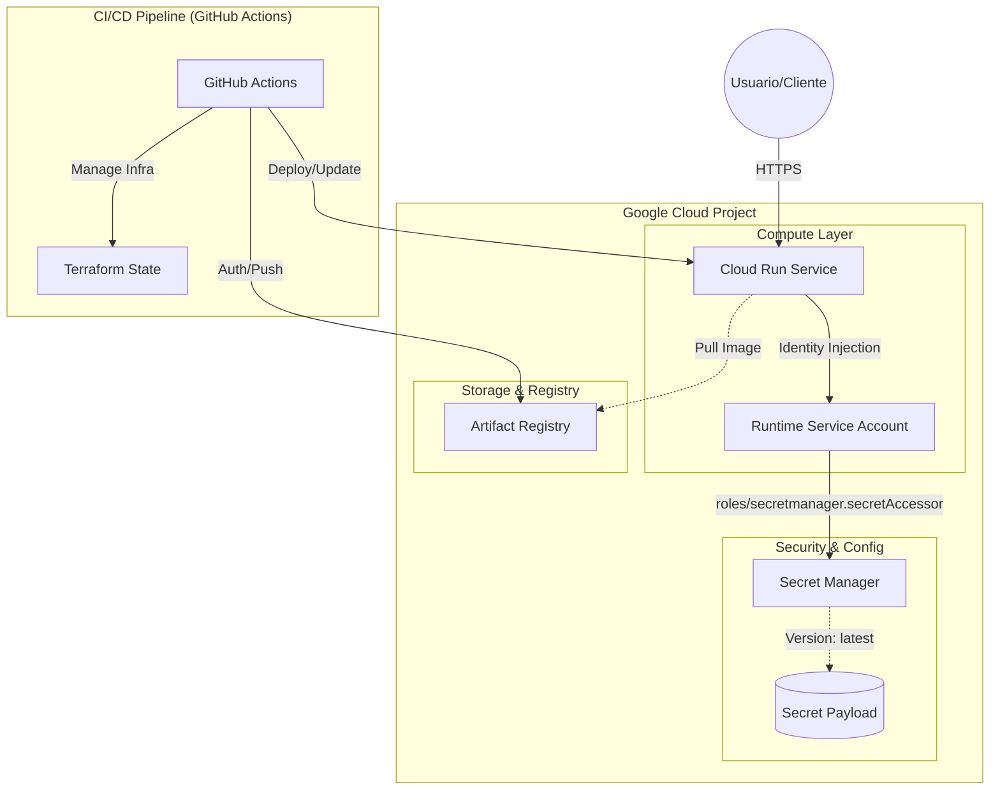

# Arquitectura del Sistema en GCP

Este diagrama describe la infraestructura desplegada para la aplicación **FastAPI** utilizando una arquitectura serverless y segura.

```mermaid
graph TD
    User((Usuario/Cliente)) -->|HTTPS| GCR[Cloud Run Service]
    
    subgraph "Google Cloud Project"
        subgraph "Compute Layer"
            GCR -->|Identity Injection| SA_Runtime[Runtime Service Account]
        end

        subgraph "Security & Config"
            SA_Runtime -->|roles/secretmanager.secretAccessor| SM[Secret Manager]
            SM -.->|Version: latest| Secret[(Secret Payload)]
        end

        subgraph "Storage & Registry"
            GCR -.->|Pull Image| AR[Artifact Registry]
        end
    end

    subgraph "CI/CD Pipeline (GitHub Actions)"
        GHA[GitHub Actions] -->|Auth/Push| AR
        GHA -->|Deploy/Update| GCR
        GHA -->|Manage Infra| TF[Terraform State]
    end
```